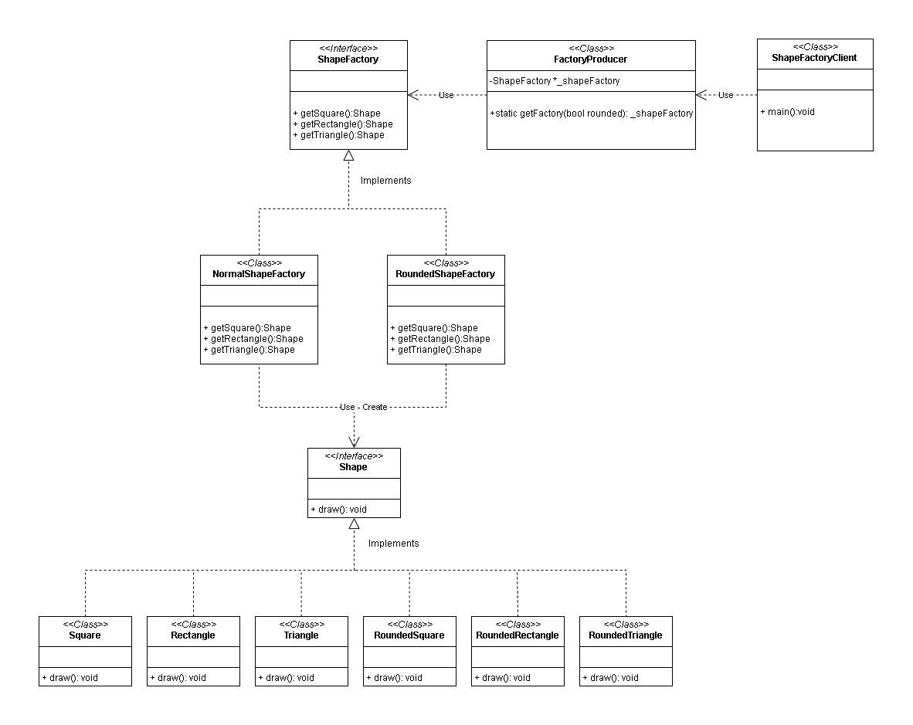
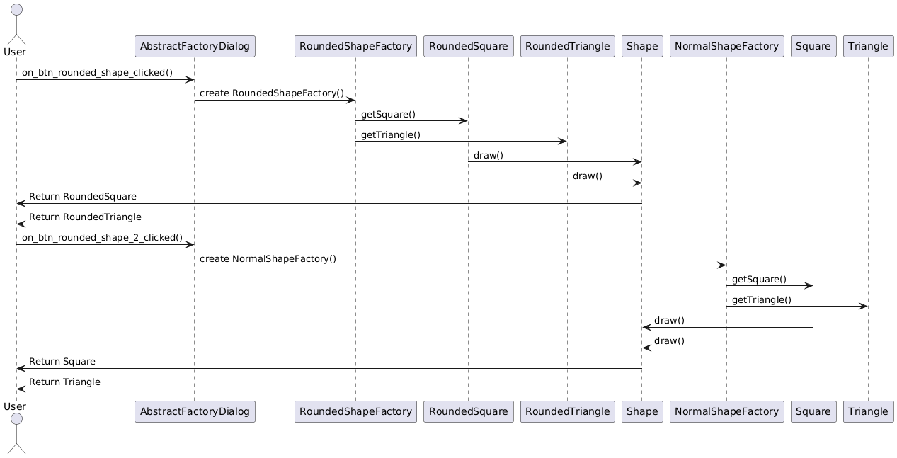
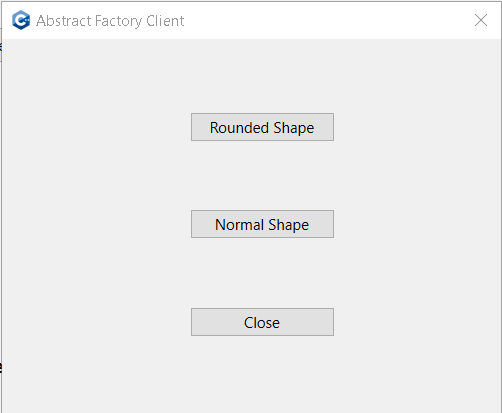

# Abstract Factory Implementation

## Description: 

- **Abstract Factory Pattern Demonstration**

This project showcases the Abstract Factory design pattern by implementing a flexible and scalable system for creating various types of shapes. The Abstract Factory pattern allows the client code to remain independent of the concrete classes of the shapes it uses. By defining an abstract factory interface, the project demonstrates how to produce families of related objects (shapes) without specifying their exact classes.

## Revised Explanation:

  

  <em>Fig 1: Abstract Factory pattern - Class Diagram, this diagram was generated with app.diagrams.net</em>

1. **Shape Interface:**

 - The Shape interface declares a draw() method that must be implemented by all concrete shape classes.
 - This interface ensures consistency in how shapes are drawn.

2. **Concrete Shape Classes:**

 - Triangle, Square, Rectangle, RoundedSquare, RoundedRectangle, and RoundedTriangle implement the Shape interface.
 - Each class provides a specific implementation of the draw() method, representing different types of shapes (normal vs. rounded).

3. **ShapeFactory Interface:**

 - The ShapeFactory interface declares methods for creating Square, Rectangle, and Triangle shapes.
 - This interface acts as the abstract factory, providing a blueprint for concrete factories to follow.

4. **Concrete Factories:**

 - NormalShapeFactory and RoundedShapeFactory are concrete implementations of the ShapeFactory interface.
 - Each factory creates different variants of shapes:
    - NormalShapeFactory: Creates standard shapes (Square, Rectangle, Triangle).
    - RoundedShapeFactory: Creates rounded shapes (RoundedSquare, RoundedRectangle, RoundedTriangle).

5. **Factory Methods in Concrete Factories:**

 - The factory methods in NormalShapeFactory and RoundedShapeFactory return specific implementations of the Shape interface:
    - In NormalShapeFactory:
        - getSquare() returns a Square.
        - getRectangle() returns a Rectangle.
        - getTriangle() returns a Triangle.
    - In RoundedShapeFactory:
        - getSquare() returns a RoundedSquare.
        - getRectangle() returns a RoundedRectangle.
        - getTriangle() returns a RoundedTriangle.
- These methods are responsible for instantiating and returning the appropriate Shape implementation based on the type of factory.

6. **FactoryProducer Class:**

 - The FactoryProducer class includes a static method getFactory(bool rounded) that returns an instance of ShapeFactory.
 - Functionality:
    - If rounded is true, getFactory() returns an instance of RoundedShapeFactory, which creates rounded shapes.
    - If rounded is false, it returns an instance of NormalShapeFactory, which creates standard shapes.
 - The getFactory method is crucial because it returns a reference to the appropriate concrete factory (either NormalShapeFactory or RoundedShapeFactory) through a reference to the ShapeFactory interface. This ensures that the client code can remain decoupled from the specific factory implementations.

7. **ShapeFactoryClient Class (Theoretical Concept):**

 - The ShapeFactoryClient class is introduced as a theoretical concept rather than a fully implemented class.
 - Purpose:
    - This concept demonstrates how a client could interact with the abstract factory pattern in practice.
    - It emphasizes that the primary concern for a developer is to ensure that the getFactory method provides a reference to the correct concrete factory, allowing for the creation of specific shapes through the ShapeFactory interface.
 - Implementation:
    - The actual implementation of such a client class is left to the developer, who should ensure that the factory selected by getFactory is used to create and draw shapes in a flexible and decoupled manner.

**Key Takeaway:**

 - The ShapeFactoryClient serves as a conceptual guide for developers. The critical aspect is that the getFactory method from the FactoryProducer returns a reference to the appropriate concrete factory (NormalShapeFactory or RoundedShapeFactory) through a reference to the ShapeFactory interface. This allows the client code to dynamically choose between different factory implementations without being tightly coupled to any specific one, maintaining flexibility and adherence to the abstract factory design pattern.

The implementation of the Abstract Factory pattern addresses the issues of flexibility, maintainability, scalability, and adherence to design principles in a complex system involving multiple shape types.

  

  <em>Fig 1: Abstract Factory pattern - Diagram of sequence, this diagram was generated with PlantUML</em>

## Sequence Diagram Explanation:

The sequence diagram shown illustrates the interaction between a user, the AbstractFactoryDialog, the shape factories (RoundedShapeFactory and NormalShapeFactory), and the Shape objects (RoundedSquare, RoundedTriangle, Square, and Triangle). It demonstrates how different shape instances are created and used.

**Sequence:**

1. **User Interaction (Button Click):**

- The user clicks the on_btn_rounded_shape_clicked() button on the AbstractFactoryDialog interface. This action triggers the creation of rounded shapes.
- The user then clicks the on_btn_rounded_shape_2_clicked() button, which triggers the creation of normal shapes.

2. **Factory Creation:**

- When the user clicks the button for rounded shapes, the AbstractFactoryDialog creates an instance of RoundedShapeFactory.
- When the user clicks the button for normal shapes, the AbstractFactoryDialog creates an instance of NormalShapeFactory.

3. **Shape Creation:**

- The RoundedShapeFactory produces RoundedSquare and RoundedTriangle shapes upon requests.
- The NormalShapeFactory produces Square and Triangle shapes upon requests.

4. **Drawing Shapes:**

- Each shape instance calls its draw() method. This involves interaction with the base Shape class.
- The drawing action is handled internally, but the shapes are prepared for the user.

5. **Returning Shapes to User:**

- After drawing, the Shape objects are returned to the user. The user receives the shapes created by the factories:
    - RoundedSquare and RoundedTriangle for the rounded shapes button.
    - Square and Triangle for the normal shapes button.

This diagram and explanation illustrate the flow of how shape instances are created, used, and returned to the user through the factory pattern.

## Key Components
1. **Abstract Factory Interface (`ShapeFactory`):** Defines methods for creating different shapes such as squares, rectangles, and triangles.

2. **Concrete Factories:** `NormalShapeFactory` and `RoundedShapeFactory` implement the `ShapeFactory` interface to create normal and rounded shapes, respectively.

1. **Shape Products:** Includes `Triangle`, `Square`, `Rectangle`, `RoundedTriangle`, `RoundedSquare`, and `RoundedRectangle`, each implementing the `Shape` interface with a `draw()` method to output their respective visual representations.

## Project Functionality
The client code interacts with the abstract factory to obtain shape objects and invoke their methods. The client is represented by the use of each concrete factory (`NormalShapeFactory` and `RoundedShapeFactory`), triggered by clicking on the respective push buttons in the UI. This separation ensures that adding new shapes or altering existing ones does not require changes to the client code. The client only needs to implement the new methods provided by the factories to create and use additional shapes, such as triangles, making the system both flexible and easy to extend.

  

  <em>Fig 1: Abstract Factory Client Screen</em>

## Code Limitations Without Abstract Factory Pattern

Without using the Abstract Factory pattern, the following limitations arise:

- **Tight Coupling:** The client code would directly instantiate concrete shape objects, leading to tight coupling between the client and the specific shape classes. This means that the client is directly responsible for creating specific shape objects like Square, Rectangle, or Triangle.

- **Lack of Flexibility:** In a system that does not use the Abstract Factory pattern, the client code becomes tightly coupled with the concrete classes of the shapes it creates. This tight coupling leads to several challenges:

    1. **Violation of the Open/Closed Principle:** The Open/Closed Principle, a key concept in software design, states that a class should be open for extension but closed for modification. In other words, new functionality should be added by extending the existing code, not by altering it. Without the Abstract Factory pattern, introducing new shapes (e.g., Pentagon, Hexagon, or RoundedTriangle) requires modifications to the client code to accommodate these new shapes. This violates the Open/Closed Principle, making the system fragile and more prone to errors.

    2. **Increased Maintenance Effort:** As more shapes are introduced, the client code must include additional logic to handle the creation of these new shapes. This often results in cluttered code with numerous conditionals or switches, making the client code harder to read, maintain, and extend. Each modification or addition of new shapes increases the likelihood of bugs and reduces the overall code quality.

    3. **Limited Reusability:** Since the client code is tailored to the specific shapes it creates, reusing the client code in other contexts becomes difficult. If the requirements change (e.g., using different shapes in another application), the client code must be rewritten or heavily modified, reducing its reusability across different projects.

    4. **Difficulty in Extensibility:** Introducing new shape variations or additional factories would necessitate significant changes to the existing codebase, reducing maintainability and scalability. This tight coupling hinders the system's ability to adapt to new requirements or extend its functionality efficiently.

- **Example Scenario:**
Suppose the client code initially handles only Square and Rectangle objects. Later, the system needs to support Triangle and Circle shapes. Without the Abstract Factory pattern, the client code must be updated with new logic to create these shapes. This could involve adding new conditional checks or creating specific methods for each new shape. Such modifications directly contravene the Open/Closed Principle, as the client code is not closed to modification when extending its functionality.

By contrast, with the Abstract Factory pattern, adding new shapes simply requires extending the factory classes. The client code remains untouched, as it interacts with the abstract factory to request shapes, without needing to know the specifics of the shape creation process. This ensures that the system remains flexible, extensible, and easier to maintain.

## Commit History and Code Extension

**Before Extending Code Functionality:**

- Commit Hash: `5a399a13c1a01018123c6f092b8143c15d2083ef`
    
    - **Description:** Up to this commit, the implementation directly applies the Factory Method pattern to the available shapes within the Abstract Factory method. The factories (`NormalShapeFactory` and `RoundedShapeFactory`) are configured to produce only squares and rectangles. This approach adheres to the principles of the Factory Method pattern, focusing on the creation of these shapes but without including triangles.

**After Extending Code Functionality:**

- simply run: `git checkout abstract_factory` or go to the Commit Hash: `git checkout 573ff2d851bc4016f25b1f43e544d37226186c28`

    - **Description:** Extended the Abstract Factory to include methods for creating `NormalTriangle` and `RoundedTriangle` shapes in the `NormalShapeFactory` and `RoundedShapeFactory`, respectively. This enhancement demonstrates the flexibility of the Abstract Factory pattern by allowing the addition of new shape types without altering the existing client code. The client is represented by the use of the respective factories through button clicks in the UI, which now trigger the creation of the newly added triangle shapes along with the existing square and rectangle shapes. The client only needs to implement the new methods provided by the factories to utilize these additional shapes.

## Summary:

This project illustrates the power of the Abstract Factory pattern in building a flexible and maintainable system that can easily adapt to new requirements and product variations.