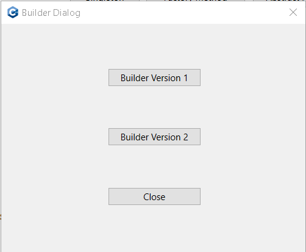

# Builder Implementation Version 1

## Description: 

- **Builder Pattern Demonstration**

This project is a demonstration of the Builder Design Pattern applied to a meal preparation system. The system allows users to create different types of meals—Vegetarian and Non-Vegetarian—each composed of various items like burgers and cold drinks. The meals are constructed step by step, allowing for flexibility and customization in the composition of each meal.

The system is implemented in a scenario where a restaurant or a fast-food chain offers meal combos to its customers. Each meal combo consists of a main item (such as a burger) and a beverage (such as Coke or Pepsi). The customer has the option to choose between a Vegetarian Meal or a Non-Vegetarian Meal. The system needs to handle the construction of these meal combos in a structured and flexible manner, ensuring that the correct components are included in each meal.

## Class Diagram Explanation:

The class diagram represents the structural design of the meal preparation system. 

  

  <em>Fig 1: Builder pattern version 1 - Class Diagram, this diagram was generated with app.diagrams.net</em>

It shows the relationships between various classes, including inheritance and composition. Below is a detailed explanation of the main components:

- **Packing and Its Implementations:**

    - The `Packing` abstract class defines the packing method that all concrete packing classes must implement.
    - `BottlePacking` and `WrapperPacking` are concrete implementations that represent different types of packing methods (bottle and wrapper, respectively).

- **Item and Its Subclasses:**

    - The `Item` abstract class outlines the structure for items that can be added to a meal, including methods to get the item’s name, price, and packing type.
    - `Burger` and `ColdDrink` are abstract subclasses of `Item` that represent categories of items.
    - `ChickenBurger`, `VegetarianBurger`, `Coke`, and `Pepsi` are concrete implementations that specify the details of each item.

- **Meal Class:**

    - The `Meal` class aggregates `Item` objects, representing the complete meal. It provides methods to add items, calculate the total cost, and display the meal’s contents.

- **MealBuilder Class:**

    - The MealBuilder class provides the logic for constructing different types of meals by assembling the appropriate items.

- **Dialog Classes:**

    - `BuilderVer1Dialog` is responsible for user interaction and triggering the meal-building process.
    - `BuilderVersionDialog` serves as an entry point for the application, allowing users to choose different builder versions.

**The Builder pattern is implemented as follows:**

- **Builder:** The `MealBuilder` class acts as the Builder. It contains methods to prepare different types of meals (`prepareVegBurger()` and `prepareNonVegBurger()`), each composed of specific items.

- **Product:** The `Meal` class represents the complex object (product) that is being constructed. A `Meal` contains multiple `Item` objects.

- **Concrete Builders:** The methods within `MealBuilder` (such as `prepareVegBurger()` and `prepareNonVegBurger()`) act as concrete builders, each assembling a specific type of meal by adding different `Item` objects (e.g., `VegetarianBurger`, `Coke`, `ChickenBurger`, `Pepsi`).

- **Director:** The user interface class `BuilderVer1Dialog` serves as the Director that triggers the building process. It decides which type of meal to build based on user input.

**Benefits of the Builder Pattern**

- **Flexibility:** The Builder pattern allows for the creation of complex objects with varying internal structures. This flexibility is ideal for scenarios where the composition of the object can change based on user input or different configurations.

- **Separation of Concerns:** The pattern separates the construction logic from the actual product representation, making the codebase easier to maintain and extend.

- **Reusability:** Builders can be reused across different contexts to create various product configurations without modifying the client code.

## Sequence Diagrams Explanation:

**Vegetarian Meal Preparation**

  

  <em>Fig 1: Builder pattern showing the sequence of a vegetarian meal object instantiation - Diagram of sequence, this diagram was generated with PlantUML</em>

The sequence diagram for Vegetarian Meal Preparation depicts the interaction between the `BuilderVer1Dialog`, `MealBuilder`, `Meal`, `VegetarianBurger`, and `Coke` classes when the user selects the Vegetarian Meal option.

1. **User Action:** The user clicks the "Vegetarian Meal" button.
2. **MealBuilder:** The `BuilderVer1Dialog` triggers the `MealBuilder` to prepare a vegetarian meal by calling the `prepareVegBurger()` method.
3. **Meal Creation:** The `MealBuilder` creates a new `Meal` object and adds a `VegetarianBurger` and a `Coke` to the meal.
4. **Item Packing:** Each `Item` (burger and drink) has a packing method (`packing()`), which specifies the type of packing used (Wrapper for the burger and Bottle for the drink).
5. **Displaying Items:** The `Meal` object displays the items and their respective packing methods.
6. **Total Cost:** The total cost of the meal is calculated and displayed.

**Non-Vegetarian Meal Preparation**

  

  <em>Fig 1: Builder pattern showing the sequence of a non vegetarian meal object instantiation, this diagram was generated with PlantUML</em>

The sequence diagram for Non-Vegetarian Meal Preparation follows a similar flow but with different items:

1. **User Action:** The user clicks the "Non-Vegetarian Meal" button.
2. **MealBuilder:** The `BuilderVer1Dialog` triggers the `MealBuilder` to prepare a non-vegetarian meal by calling the `prepareNonVegBurger()` method.
3. **Meal Creation:** The `MealBuilder` creates a new `Meal` object and adds a `ChickenBurger` and a `Pepsi` to the meal.
4. **Item Packing:** The packing methods specify the type of packing used (Wrapper for the burger and Bottle for the drink).
5. **Displaying Items:** The `Meal` object displays the items and their respective packing methods.
6. **Total Cost:** The total cost of the meal is calculated and displayed.

## Project Functionality

Once the user has launched the application, here’s how they will interact with the UI to demonstrate the Builder pattern:

1. **Press Build Button**: The UI showing the 'Builder Dialog' asking to press a Builder version to be executed

  

  <em>Fig 1: Builder Main Screen</em>

2. **Select Builder Version 1**: A new dialog window titled "Builder Version 1 Dialog" will appear.

  

  <em>Fig 1: Builder Version 1 Client Screen</em>

3. **Choose a Meal Type:**

In the "Builder Version 1 Dialog", the user is presented with two buttons:

- **Vegetarian Meal:** This option will create a meal with a `VegetarianBurger` and a `Coke`.
- **Non-Vegetarian Meal:** This option will create a meal with a `ChickenBurger` and a `Pepsi`.

- The user clicks on either the `Vegetarian Meal` or `Non-Vegetarian Meal` button based on their preference.

4. **Meal Construction and Display:**

Upon clicking one of the meal options, the system constructs the selected meal using the `MealBuilder` class.

- For **Vegetarian Meal**:
    - The builder creates a `VegetarianBurger` and a `Coke`.
    - Each item is wrapped using `WrapperPacking` for the burger and `BottlePacking` for the drink.
- For **Non-Vegetarian Meal**:
    - The builder creates a `ChickenBurger` and a `Pepsi`.
    - Similarly, items are packed with `WrapperPacking` and `BottlePacking`.

**Output**: The system displays the details of the constructed meal in the same dialog window.

- **Displayed Information:**
    - **Item Name:** The name of each item (e.g., Vegetarian Burger, Coke).
    - **Packing Method:** The type of packing used for each item (e.g., Wrapper Packing for burgers, Bottle Packing for drinks).
    - **Price:** The price of each item.
    - **Total Cost:** The total cost of the meal.

The user reviews the meal details, which show the list of items, their packing methods, and the total cost.

To close the dialog, the user can simply click the "Close" or "Exit" button.

## Summary:

This project demonstrates the practical application of the Builder Design Pattern in constructing complex objects—in this case, meal combos. By using the Builder pattern, the system gains flexibility, maintainability, and reusability, making it easier to create various meal configurations without modifying the core logic. The sequence diagrams for both Vegetarian and Non-Vegetarian meal preparation highlight the step-by-step construction process, while the class diagram provides a clear overview of the system’s structure. Overall, this implementation effectively showcases the benefits of the Builder pattern in a real-world scenario.