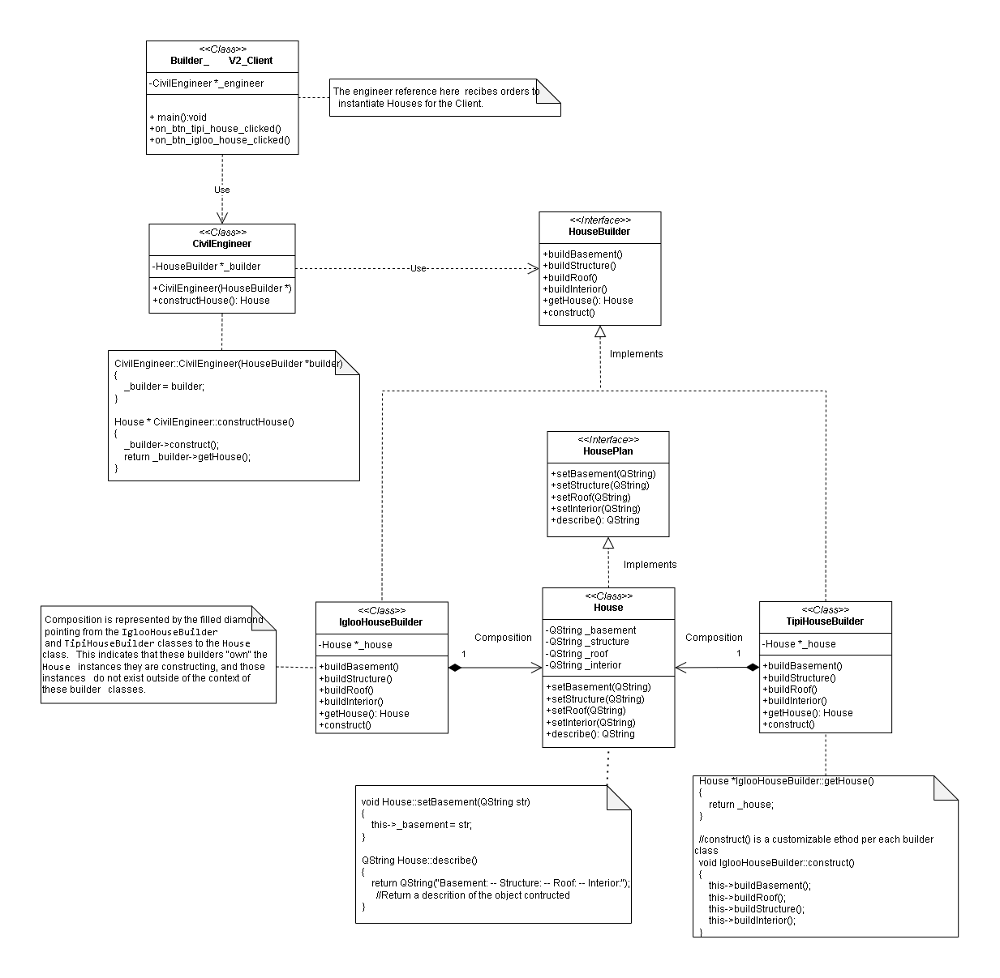
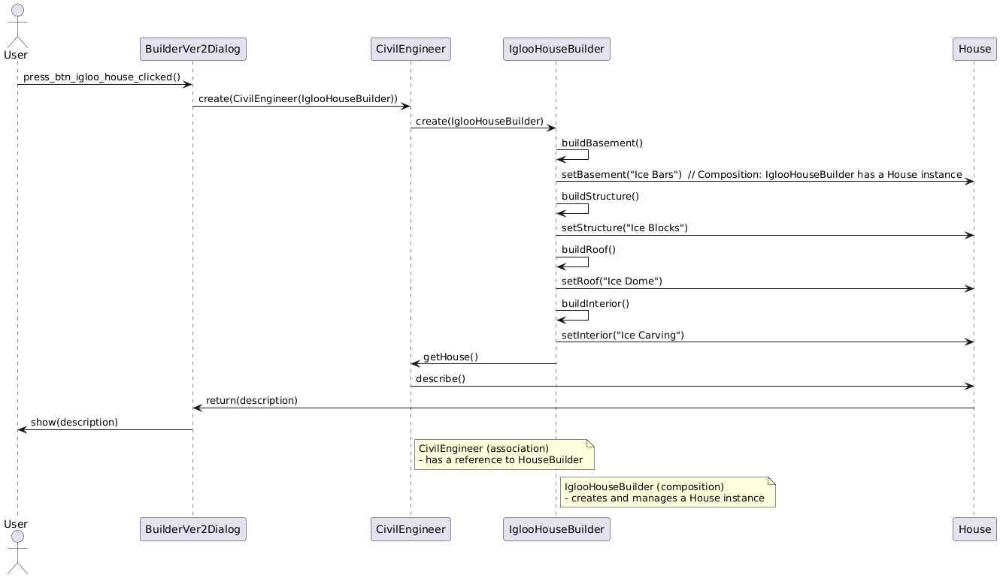
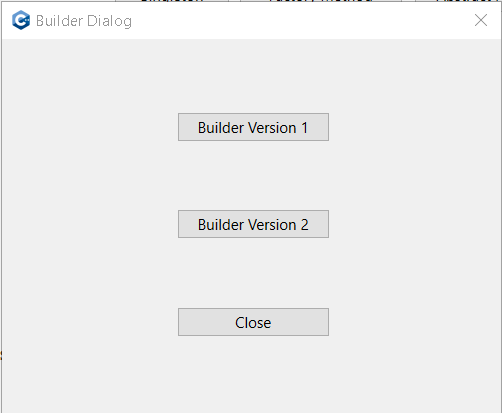
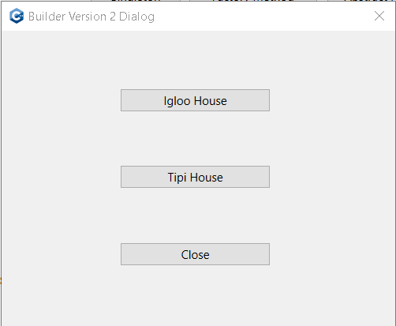

# Builder Implementation Version 2

## Description: 

- **Builder Pattern Demonstration**

The Multi-Builder House Construction System is an advanced application that demonstrates the Builder design pattern in action, specifically tailored for constructing two distinct types of houses: Tipi and Igloo. This Qt-based application allows users to select the type of house they wish to construct, showcasing how different building processes can be managed and executed through a common interface.

The System is implemented in a virtual construction simulation environment where users can interact with the application to simulate the construction of two distinct types of houses: Tipi and Igloo. This simulation is designed for educational or demonstration purposes, showcasing how different construction methods can be managed through a unified interface.

## Class Diagram Explanation with Detailed Composition Relationship:

The class diagram represents the implementation of the Builder design pattern, specifically tailored to constructing different types of houses using different builders (IglooHouseBuilder, TipiHouseBuilder).

It the structural design of the house types construction system. 

  

  <em>Fig 1: Builder pattern version 2 - Class Diagram, this diagram was generated with app.diagrams.net</em>

The key components of the diagram and their relationships are as follows:

1. **Classes and Interfaces:**
- **HousePlan (Interface):** This interface defines the blueprint for a `House`. It declares the methods `setBasement`, `setStructure`, `setRoof`, and `setInterior` that any concrete `House` class must implement.
- **House:** This class implements the `HousePlan` interface and represents the actual product being built. It contains attributes like `_basement`, `_structure`, `_roof`, and `_interior` and provides the implementation for the methods defined in `HousePlan`.
- **HouseBuilder (Abstract Class):** This abstract class declares the steps involved in building a house (`buildBasement`, `buildStructure`, `buildRoof`, `buildInterior`) and a method `getHouse` to return the constructed house. The construct method orchestrates the construction process.
- **IglooHouseBuilder & TipiHouseBuilder:** These are concrete builders that inherit from `HouseBuilder`. Each class is responsible for constructing a specific type of house (Igloo or Tipi) by implementing the construction methods defined in `HouseBuilder`.

2. **Composition Relationship:**
- **Ownership and Lifecycle Management:**
    - Both `IglooHouseBuilder` and `TipiHouseBuilder` classes create and manage their own instance of the `House` class. The `House` instance is a private member of these builder classes (`_house`), indicating a composition relationship.
    - **Composition** is a strong form of association where the lifecycle of the `House` object is tightly bound to the builder class that creates it. The `House` object is created when the builder is instantiated and is destroyed when the builder is destroyed, as the `House` is not shared outside of its builder class.
    - The composition relationship is depicted in the class diagram with a filled diamond pointing from `IglooHouseBuilder` and `TipiHouseBuilder` to the `House` class. This shows that these builder classes "own" the `House` objects they create, and those objects do not exist independently outside of the builders.

3. **Association and Usage:**
- **CivilEngineer:** This class represents the Director in the Builder pattern. It receives a pointer to a `HouseBuilder` object (which can be an instance of either `IglooHouseBuilder` or `TipiHouseBuilder`) through its constructor. The `CivilEngineer` then directs the construction process using the provided builder and ultimately retrieves the constructed `House` object.
- **BuilderVer2Dialog:** This class interacts with the `CivilEngineer` to trigger the construction process when the user clicks on the corresponding buttons (`btn_tipi_house` or `btn_igloo_house`). It creates instances of `CivilEngineer`, passing in the appropriate builder (either `TipiHouseBuilder` or `IglooHouseBuilder`), and then invokes the construction of the house.

4. **Associations in the Diagram:**
- The association between `BuilderVer2Dialog` and `CivilEngineer` indicates that `BuilderVer2Dialog` uses the `CivilEngineer` to manage the construction process.
- The relationship between `CivilEngineer` and `HouseBuilder` is an association, not a composition. The `CivilEngineer` class does not own the `HouseBuilder` object in the sense that it would manage its lifecycle. Instead, `CivilEngineer` uses a `HouseBuilder` object to construct a `House`. The association is represented by a simple line between `CivilEngineer` and `HouseBuilder`, indicating that `CivilEngineer` interacts with a `HouseBuilder` object but does not manage its creation or destruction.
- The composition relationship between `IglooHouseBuilder`/`TipiHouseBuilder` and `House` is also represented by a filled diamond, indicating that these builder classes are responsible for creating and managing the lifecycle of the `House` objects they construct.

The class diagram showcases the Builder pattern's structure, emphasizing the composition relationship between the `House` class and the concrete builders (`IglooHouseBuilder` and `TipiHouseBuilder`). This relationship highlights that the builders have full control over the `House` objects they create, and these objects are integral parts of the builders, with no independent existence outside the builders' context. Additionally, the diagram demonstrates how the `CivilEngineer` class orchestrates the construction process, interacting with the builders to produce the final `House` product.

## Scenario: Constructing Two Types of Houses

1. **Application Launch:**

- Upon launching the application, users are greeted with the `BuilderVersionDialog` interface, which provides options to select between different builder versions.

2. **Builder Version Selection:**

- Users choose "Builder Version 2" to access the more advanced construction interface, which is implemented in `BuilderVer2Dialog`.

3. **Choosing House Type:**

- In BuilderVer2Dialog, users have two options:
    - **Tipi House:** Represented by the `TipiHouseBuilder` class.
    - **Igloo House:** Represented by the `IglooHouseBuilder` class.

4. **Construction Process:**

- **Tipi House Construction:**

    - Users click the "Tipi House" button.
    - The `on_btn_tipi_house_clicked()` slot in `BuilderVer2Dialog` is triggered, creating an instance of `CivilEngineer` with a `TipiHouseBuilder`.
    - `CivilEngineer` invokes the `constructHouse()` method, which in turn calls the `construct()` method on `TipiHouseBuilder`.
    - `TipiHouseBuilder` sequentially builds the house:
        - **Basement:** Set to "Wooden Poles."
        - **Structure:** Made from "Wood and Ice."
        - **Roof:** Composed of "Wood, Caribou, and Seal Skins."
        - **Interior:** Furnished with "Fire Wood."
    - The fully constructed `House` object is returned and its description is outputted to the debug log, showcasing the Tipi house attributes.

- **Igloo House Construction:**

    - Users click the "Igloo House" button.
    - The `on_btn_igloo_house_clicked()` slot in `BuilderVer2Dialog` is triggered, creating an instance of `CivilEngineer` with an `IglooHouseBuilder`.
    - `CivilEngineer` invokes the `constructHouse()` method, which calls the `construct()` method on `IglooHouseBuilder`.
    - `IglooHouseBuilder` sequentially builds the house:
        - **Basement:** Set to "Ice Bars."
        - **Structure:** Made from "Ice Blocks."
        - **Roof:** Composed of "Ice Dome."
        - **Interior:** Decorated with "Ice Carvings."
    - The fully constructed `House` object is returned and its description is outputted to the debug log, showcasing the Igloo house attributes.

5. **Final Output:**

- The application provides detailed descriptions of the constructed houses via the debug log, allowing users to see the specific attributes of each house type they have chosen to build.

## Class Interaction and Flow:

- **BuilderVer2Dialog:** Acts as the main user interface for house selection and construction. It handles user interactions and delegates the construction tasks to the appropriate builder classes.

- **CivilEngineer:** Coordinates the house construction process by using a `HouseBuilder`. It encapsulates the construction logic and ensures that the house is built according to the specified builder's implementation.

- **TipiHouseBuilder and IglooHouseBuilder:** Concrete builders that provide specific implementations for constructing Tipi and Igloo houses, respectively. They define how each house's components (basement, structure, roof, and interior) are built.

- **House:** Represents the final product with attributes set by the builders. It provides a method to describe the house, summarizing its construction details.

## Sequence Diagram Explanation:

The sequence diagram illustrates the interactions between the user, BuilderVer2Dialog, CivilEngineer, and the different HouseBuilder implementations. It demonstrates how the construction of a house occurs using either the TipiHouseBuilder or IglooHouseBuilder. 

  

  <em>Fig 1: Builder pattern showing the sequence of the instantiation of an Igloo house - Diagram of sequence, this diagram was generated with PlantUML</em>

The same diagram can be adapted to show the sequence of events for constructing a Tipi house or an Igloo house by following the respective builder implementation path
It shows how the system processes requests to build different types of houses and demonstrates the composition and association relationships between classes.

**Detailed Steps for Constructing an Igloo House**
1. **User Interacts with UI:**

- **Action:** The user initiates the process by pressing a button in the `BuilderVer2Dialog` to construct an Igloo house.
- **Diagram:** `User -> BuilderVer2Dialog: press_btn_igloo_house_clicked()`

2. **Builder Version 2 Dialog Creates Civil Engineer:**

- **Action:** `BuilderVer2Dialog` creates an instance of `CivilEngineer` and passes an instance of `IglooHouseBuilder` to it.
- **Diagram:** `BuilderVer2Dialog -> CivilEngineer:create(CivilEngineer(IglooHouseBuilder))`

3. **Civil Engineer Uses HouseBuilder:**

- **Action:** The `CivilEngineer` class uses the `IglooHouseBuilder` instance to start the house construction process.
- **Diagram:** `CivilEngineer -> IglooHouseBuilder: create(IglooHouseBuilder)`

4. **HouseBuilder Builds House:**

- **Action:** The `IglooHouseBuilder` starts building the house by setting various components:
    - **Set Basement:** `IglooHouseBuilder -> House: setBasement("Ice Bars")`
    - **Set Structure:** `IglooHouseBuilder -> House: setStructure("Ice Blocks")`
    - **Set Roof:** `IglooHouseBuilder -> House: setRoof("Ice Dome")`
    - **Set Interior:** `IglooHouseBuilder -> House: setInterior("Ice Carving")`
- **Diagram:** Similar for the Igloo house construction process.

5. **HouseBuilder Constructs and Provides House:**

- **Action:** After constructing the house, the `IglooHouseBuilder` instance returns the fully constructed `House` object.
- **Diagram:** `IglooHouseBuilder -> CivilEngineer: getHouse()`

6. **Civil Engineer Gets Description of the House:**

- **Action:** The `CivilEngineer` asks the `House` instance to provide a description of the built house.
- **Diagram:** `CivilEngineer -> House: describe()`

7. **House Returns Description:**

- **Action:** The `House` instance returns a string description of its components.
- **Diagram:** `House -> BuilderVer2Dialog: return(description)`

8. **Builder Version 2 Dialog Displays Result:**

- **Action:** The `BuilderVer2Dialog` displays the description of the constructed house to the user.
- **Diagram:** `BuilderVer2Dialog -> User: show(description)`

**Relationships**
- **Association (CivilEngineer and HouseBuilder):**

    - `CivilEngineer` has a reference to a `HouseBuilder` instance, signifying that it uses `HouseBuilder` to construct houses. This is a simple association relationship.

- **Composition (HouseBuilder and House):**

    - `IglooHouseBuilder` has a composition relationship with `House`. It creates and manages its own `House` instance. The filled diamond at the `House` end of the relationship indicates that `HouseBuilder` classes have strong ownership of `House`.

This sequence diagram effectively captures the process of using the Builder pattern to construct an Igloo house, demonstrating the interactions between objects and the various relationships among them.

**Note:** The process to create an Igloo house follows exactly the same flow as the process to create a Tipi house. The only difference is the type of HouseBuilder used (IglooHouseBuilder for Igloo houses and TipiHouseBuilder for Tipi houses). All interactions and steps between the BuilderVer2Dialog, CivilEngineer, HouseBuilder, and House remain consistent.

## Project Functionality

Once the user has launched the application, here’s how they will interact with the UI to demonstrate the Builder pattern:

1. **Press Build Button**: The UI showing the 'Builder Dialog' asking to press a Builder version to be executed

  

  <em>Fig 1: Builder Main Screen</em>

2. **Select Builder Version 2**: A new dialog window titled "Builder Version 2 Dialog" will appear.

  

  <em>Fig 1: Builder Version 2 Client Screen</em>

3. **Choose a House Type:**

In the "Builder Version 2 Dialog", the user is presented with two buttons:

- **Tipi House:** This option will create a house with a `TipiHouseBuilder`.
- **Igloo House:** his option will create a house with an `IglooHouseBuilder`.

- The user clicks on either the `Tipi House` or `Igloo House` button based on their preference.

4. **House Construction and Display:**

Upon clicking one of the house options, the system constructs the selected house using the appropriate builder.

- For **Tipi House**:
    - The `CivilEngineer` uses the `TipiHouseBuilder` to construct a Tipi house.
    - The `TipiHouseBuilder` sets the basement to "Wooden Poles," the structure to "Wood and Ice," the roof to "Wood, Caribu and Seal Skins," and the interior to "Fire Wood."
- For **Igloo House**:
    - The `CivilEngineer` uses the `IglooHouseBuilder` to construct an Igloo house.
    - The `IglooHouseBuilder` sets the basement to "Ice Bars," the structure to "Ice Blocks," the roof to "Ice Dome," and the interior to "Ice Carving."

**Output**: The system displays the details of the constructed house in the same dialog window.

- **Displayed Information:**
    - **Basement:** Description of the basement construction.
    - **Structure:** Description of the house's structure.
    - **Roof:** Description of the roof construction.
    - **Interior:** Description of the interior design.

The user reviews the house details, which include the attributes of the constructed house based on the selected builder.

To close the dialog, the user can simply click the "Close" or "Exit" button.

## Summary:

This functionality showcases how the Builder design pattern can be applied to create different types of houses, highlighting the flexibility and modularity of the pattern in handling complex construction processes.