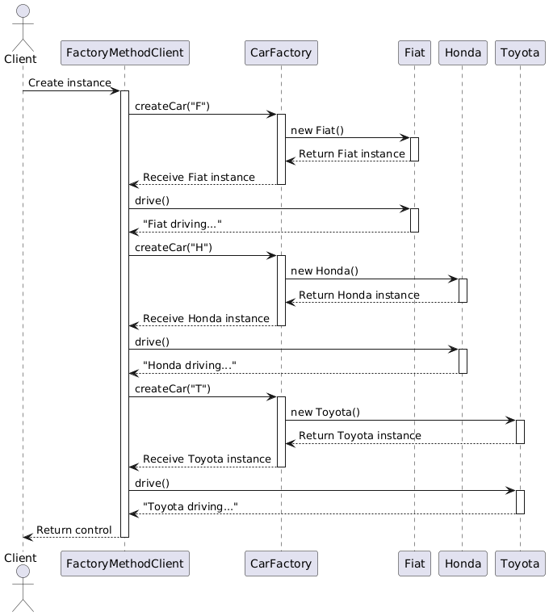

# Factory Method Implementation

## Description: 

- **Factory Method Pattern Demonstration**

The implementation consists of a client application that needs to select and drive cars from a parking lot. The types of cars available in the parking lot are represented by different classes, such as `Fiat`, `Honda`, and `Toyota`. In the initial implementation, the client class directly creates instances of these car classes based on the desired type. This approach involves duplicating code across methods and violates the `Open/Closed Principle`, as any addition of new car models requires extensive modifications.

This implementation demonstrates the application of the `Factory Method pattern` to address these issues. By centralizing the car creation logic in the `CarFactory` class, the `Factory Method pattern` simplifies the process of adding new car models and enhances code maintainability. The factory method handles instantiation based on the provided type, reducing code duplication and aligning with object-oriented design principles.

  

  <em>Fig 1: Factory Method pattern - Diagram of sequence, this diagram was generated with PlantUML</em>

## Diagram Explanation:

1. **Client:** The actor representing the entity interacting with the `FactoryMethodClient` class.
2. **FactoryMethodClient:** The main class responsible for interacting with the `CarFactory` to obtain car instances and invoking the `drive()` method.
3. **CarFactory:** The factory class that creates and returns instances of car models based on the provided type.
Fiat, Honda, Toyota: The car model classes that are created by the `CarFactory` and used by the `FactoryMethodClient`.

**Sequence:**

1. The `Client` creates an instance of `FactoryMethodClient`.
2. FactoryMethodClient requests the creation of a `Fiat` car from the `CarFactory` using `createCar("F")`.
3. The `CarFactory` creates and returns a `Fiat` instance.
4. The `Fiat` instance is used to call the `drive()` method.
5. The same process is repeated for `Honda` with "H" and `Toyota` with "T".

## Overview:

In this project, the `FactoryMethodClient` class interacts with various car models, including `Fiat`, `Honda`, and `Toyota`. The goal is to illustrate the benefits of the `Factory Method pattern` compared to a direct instantiation approach.

## Changes Overview:

**Factory Method Implemented**

- Commit `7fc6f3397c06dfccc4461209410adf634f172818`: This commit introduces the `Factory Method pattern` to centralize car creation. The `CarFactory` class was added with a static method `createCar()` to handle car instantiation based on the provided type. This change reduces code duplication and aligns with the Open/Closed Principle by centralizing creation logic in one place.

**Factory Method Applied**

- Commit ` e6d54c391eef17e154449d58b52ed53072f1d7ca`: This commit extends the `CarFactory` class to support the addition of a new car model, `Toyota`. The `createCar()` method was updated to handle the "T" type for `Toyota`, reflecting the ease of extending the factory method to accommodate new car models. The `FactoryMethodClient` class demonstrates the integration of the new model, showing how straightforward it is to add new types with the Factory Method pattern.

**Factory Method Not Implemented**

- Commit `f92f2227474be8273b720f53e2c1a234b67ade7c`: In this commit, the `Factory Method pattern` is not yet implemented. The `FactoryMethodClient` class directly creates instances of car models (Fiat, Honda, Toyota) within its constructor, `foo()`, and `bar()` methods. This approach involves code duplication and highlights the issues that the Factory Method pattern aims to resolve.

## Comparison: Before vs. After Factory Method

**Before Factory Method**

1. **Direct Instantiation:**

    - The `FactoryMethodClient` class directly instantiated car objects (Fiat, Honda, Toyota) within its constructor, `foo()`, and `bar()` methods.
    - Code for creating car instances was duplicated across these methods, requiring manual updates for each new car type.

2. **Scalability Issues:**

    - Adding a new car model required modifications to all methods where car instantiation occurred, leading to code duplication and increased maintenance overhead.

3. **Violation of Open/Closed Principle:**

   - The design required changes to existing code whenever a new car type was added. This violated the `Open/Closed Principle`, making the system less adaptable to future changes.

**After Factory Method**

1. **Centralized Creation Logic:**

    - The `CarFactory` class centralizes car creation logic in the `createCar()` method, which handles instantiation based on the type provided.
    - Direct instantiation code was removed from `FactoryMethodClient`, reducing duplication and simplifying maintenance.

2. **Ease of Extension:**

    - Adding a new car model (e.g., Toyota) involves a simple update to the `CarFactory` class. Existing methods in `FactoryMethodClient` remain unchanged, demonstrating the ease of extending the factory method.

3. **Alignment with Open/Closed Principle:**

    - The `Factory Method pattern` aligns with the `Open/Closed Principle` by allowing new car models to be added with minimal changes. The `CarFactory` class can be extended to include new types without modifying client code.

## Summary: Benefits and Limitations of the Factory Method Pattern

**Limitations Without Factory Method**

1. **Code Duplication:**

    - The code for creating car instances is repeated across multiple methods (FactoryMethodClient constructor, foo(), and bar()), leading to redundancy. This duplication requires updates in several places whenever a new car model is added or an existing one is modified.

2. **Scalability Issues:**

    - Adding new car types necessitates manual updates in every method that handles car creation. This approach increases the maintenance burden and the likelihood of errors as the codebase grows.

3. **Violation of Open/Closed Principle:**

    - The current design requires modifying existing code to accommodate new car types, which goes against the `Open/Closed Principle`. Ideally, the system should be extendable without altering existing functionality.

**Improvement With Factory Method**

1. **Centralize Car Creation:**

    - The `Factory Method pattern` centralizes the instantiation logic in a dedicated factory class or method. This change reduces code duplication and simplifies the process of adding new car types.

2. **Promote Maintainability:**

    - By confining changes related to car creation within the factory class or method, the codebase becomes easier to maintain and extend. New car models can be added without modifying existing code in multiple locations.

3. **Adhere to Open/Closed Principle:**

    - Implementing the `Factory Method pattern` aligns the system with the `Open/Closed Principle`. New car types can be introduced by extending the factory’s capabilities without altering existing client code, making the system more adaptable to future changes.

**Benefits of the Factory Method Pattern**

1. **Improved Maintainability:**

    - The centralized car creation in the `CarFactory` class eliminates code duplication, making the codebase more manageable and reducing the likelihood of errors when adding new car models.

2. **Enhanced Scalability:**

    - The `Factory Method pattern` facilitates the easy extension of car models. New models can be integrated seamlessly without altering the existing client code, supporting the growth and evolution of the system.

3. **Compliance with Open/Closed Principle:**

    - The design now adheres to the `Open/Closed Principle`, ensuring that the system is open to extensions but closed to modifications. This compliance makes the system more robust and flexible to future requirements.