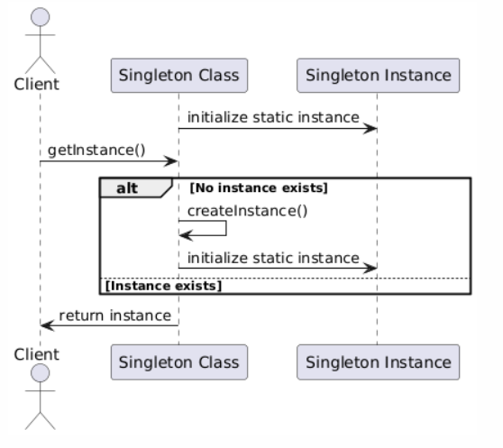
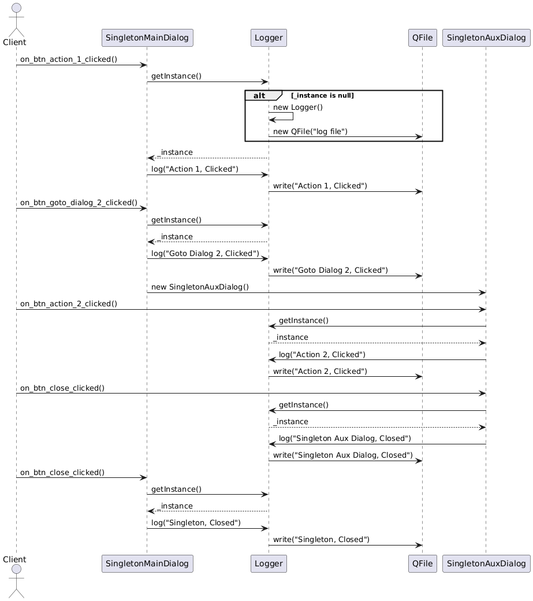

# Singleton Implementation

## Description: 

- **Singleton Design Pattern Demonstration**

This section of the project is focused on applying the Singleton design pattern to a Logger class within the Qt-based application. The Logger class is responsible for recording all user activities within the application, ensuring a consistent log is maintained throughout the application's runtime.

<p align="center">
  
</p>

<p align="center">

<p align="center">
  <em>Fig 1: General Singleton pattern - Diagram of sequence, this diagram was generated with PlantUML</em>
</p>


## Diagram Explanation
The sequence diagram illustrates the interactions between the `Client` (user), the SingletonMainDialog, the SingletonAuxDialog, and the Logger singleton instance. The focus is on how the Logger singleton is utilized across different dialogs in a Qt application, ensuring that only one instance of Logger is created and shared.

1. **Client Initiates Actions in SingletonMainDialog:**

- The user (Client) initiates the process by interacting with `SingletonMainDialog`.
- When the user clicks the "Action 1" button, the `SingletonMainDialog` retrieves the singleton instance of Logger using the getInstance() method.
- If this is the first time `getInstance()` is called, a new `Logger` instance is created. This instance initializes a log file for recording events.
- The "Action 1, Clicked" event is logged using the `Logger` instance.

2. **Navigating to SingletonAuxDialog:**

- The user clicks the "Goto Dialog 2" button in `SingletonMainDialog`.
- The `Logger` instance is retrieved again to log the "Goto Dialog 2, Clicked" event.
- The `SingletonAuxDialog` is then instantiated, and control is passed to this dialog.

3. **Actions in SingletonAuxDialog:**

- In `SingletonAuxDialog`, the user clicks the "Action 2" button.
- The `Logger` singleton is retrieved, and the "Action 2, Clicked" event is logged.
- The user then closes the `SingletonAuxDialog`, which triggers another log entry: "Singleton Aux Dialog, Closed."

4. **Closing `SingletonMainDialog`:**

- Finally, the user closes the `SingletonMainDialog`, which logs the "Singleton, Closed" event using the same `Logger` instance.

## Sequence of the Diagram Explanation

1. **SingletonMainDialog Initialization:**

- The user initiates an action in `SingletonMainDialog`.
- The `Logger` singleton is created (if not already created) and logs the first action ("Action 1, Clicked").

2. **Transition to SingletonAuxDialog:**

- The user navigates to `SingletonAuxDialog` from `SingletonMainDialog`.
- The `Logger` instance logs the transition action ("Goto Dialog 2, Clicked").

3. **Action in SingletonAuxDialog:**

- Within `SingletonAuxDialog`, the user performs an action ("Action 2, Clicked").
- The `Logger` instance records this action.
- The user closes the dialog, and the `Logger` logs the closing action ("Singleton Aux Dialog, Closed").

4. **Closing the Main Dialog:

- The final action involves closing the `SingletonMainDialog`.
- The `Logger` logs this event ("Singleton, Closed").


<p align="center">
  
</p>

<p align="center">

<p align="center">
  <em>Fig 1: Singleton pattern - Diagram of sequence, this diagram was generated with PlantUML</em>
</p>

## Visualization Through the Sequence Diagram

- **Creation of the Logger Singleton:** The diagram begins by showing the creation of the `Logger` singleton only once. This instance is then reused throughout all interactions in both `SingletonMainDialog` and `SingletonAuxDialog`.

- **Logging Events:** Each user action is logged through calls to the `Logger` singleton, demonstrating the consistent use of the single `Logger` instance to record events in different parts of the application.

- **Dialog Interaction:** The transitions between `SingletonMainDialog` and `SingletonAuxDialog` are clearly depicted, showing how user actions in one dialog influence the behavior and logging in another.

This explanation and sequence provide a detailed overview of how the Singleton pattern is applied in this scenario and how the interactions between the various components are managed and logged within the application.

## Key Features:
1. **Initial Setup:**

    - The project began with the creation of a .gitignore file to prevent the tracking of build files in the Git repository, ensuring that only relevant changes to the source code are tracked.

2. **Logger Class Creation:**

    - A Logger class was developed to log user activities whenever the Singleton button is clicked. Initially, this class created a new log file each time the user navigated between different dialogs in the application, leading to multiple log files being generated within a single execution.

3. **Implementation of Singleton Pattern:**

    - The Singleton pattern was identified as a necessary solution to ensure that only a single instance of the Logger class exists, preventing the generation of multiple log files.
    - **Steps Taken:**
        - The constructor of the Logger class was made private to prevent direct instantiation from outside the class.
        - A static method was implemented to manage the creation and retrieval of the Logger instance, ensuring that only one instance of the Logger class is created.
        - A static instance of the Logger class was declared within the class to hold the sole instance.

4. **Final Integration:**

    - After successfully implementing the Singleton pattern, the Logger class was merged into the main branch, ensuring that the pattern is fully integrated into the application's core functionality. The final implementation ensures that a single log file is created and maintained, reflecting all user activity across different dialogs within the application.

> This project showcases the practical application of the Singleton design pattern to address real-world issues in software development, particularly in ensuring consistent logging behavior within an application.

## Comparing Singleton Implementation: Before and After

To fully understand the implementation and non-implementation of the Singleton design pattern in the Logger class, follow these steps to observe the changes in the log files generated within the log folder inside the singleton directory:

**View Singleton Pattern Unimplemented**

1. **Check Out the Commit:**

    - To see the Logger class before the Singleton pattern was applied, run the following Git command:

    ```
       git checkout 379698535c0cfea6232c76a56934765b9d3cf699

    ```

2. **Inspect the Log Files:**

    - Navigate to the singleton/log folder in your project directory.
    - In this state, the Logger class generates a new log file each time you navigate between different dialogs in the application, resulting in multiple log files being created within a single execution.

**View Singleton Pattern Implemented**

1. **Check Out the Singleton Branch:**

    - To see the Logger class with the Singleton pattern implemented, run:

    ```
       git checkout singleton
    ```

2. **Inspect the Log Files:**

    - Again, navigate to the singleton/log folder.
    - With the Singleton pattern implemented, you will notice that only one log file is generated and maintained throughout the application's runtime, regardless of how many times you navigate between dialogs.

**Summary**

By switching between these commits and examining the contents of the log folder within the singleton directory, you can directly observe the impact of the Singleton pattern on the Logger class. The difference in the number and consistency of log files will highlight the effectiveness of the Singleton design pattern in ensuring that only a single instance of the Logger class exists during the application's execution.